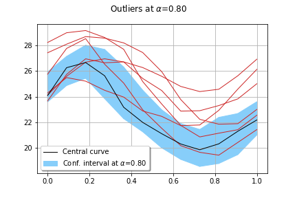
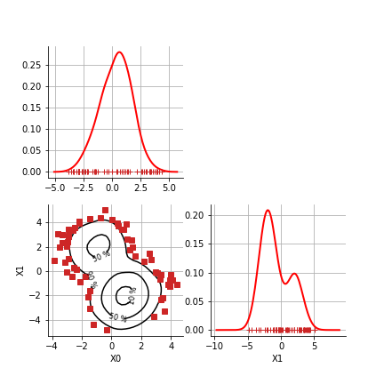

[](https://circleci.com/gh/mbaudin47/othdrplot)
[](
    https://python.org)
[](https://www.gnu.org/licenses/lgpl-3.0)

# otHDRPlot

## What is it?

This project implements the functional highest density region boxplot technique (Hyndman and Shang, 2009). 

When you have functional data (i.e. a set of curves), you will want to answer
some questions such as:

* What is the mode curve?
* Can I draw a confidence interval?
* Or, is there any outlier curves?

This module allows you to do this: 

```
import othdrplot
algo = othdrplot.ProcessHighDensityRegionAlgorithm(
    processSample, reducedComponents, reducedDistribution, [0.8, 0.5]
)
algo.run()
algo.drawOutlierTrajectories()
algo.draw()
```

The output is the following figure: 



In the situation where a multivariate sample is given, the 
HighDensityRegionAlgorithm allows to plot the 
regions where the density is associated with a 
given fraction of the population.

```
import openturns
# Estimate the distribution
myks = ot.KernelSmoothing()
distribution = myks.build(sample)
# Create the HDR algorithm
algo = othdrplot.HighDensityRegionAlgorithm(sample, distribution)
algo.run()
algo.draw()
```

The output is the following figure: 



## How to install?

### Requirements

[numpy]: http://www.numpy.org
[matplotlib]: https://matplotlib.org
[OpenTURNS]: http://www.openturns.org

The dependencies are: 

- Python >= 2.7 or >= 3.3
- [numpy] >= 0.10
- [matplotlib] >= 1.5.3
- [OpenTURNS] >= 1.16

### Installation

Using the latest python version is prefered! 

To install from pip:

```
pip install othdrplot
```

To install from github:

```
git clone git@github.com:mbaudin47/othdrplot.git
cd othdrplot
python setup.py install
```

## Documentation

[Introduction to high density region plots]: https://github.com/mbaudin47/othdrplot/tree/master/doc/documentation.ipynb

A short introduction to the algorithm is provided in the [Introduction to high density region plots].

## Examples

[doc]: https://github.com/mbaudin47/othdrplot/tree/master/doc/examples
[MatrixPlot example]: https://github.com/mbaudin47/othdrplot/tree/master/doc/examples/MatrixPlot.ipynb
[HDRAlgorithm 3D example]: https://github.com/mbaudin47/othdrplot/blob/master/doc/examples/HighDensityRegionAlgorithm-3D-example.ipynb
[HDRAlgorithm 2D example]: https://github.com/mbaudin47/othdrplot/blob/master/doc/examples/HighDensityRegionAlgorithm-example.ipynb
[ProcessHDR in 2D]: https://github.com/mbaudin47/othdrplot/blob/master/doc/examples/ProcessHighDensityRegionAlgorithm-example.ipynb
[ProcessHDR in 3D]: https://github.com/mbaudin47/othdrplot/blob/master/doc/examples/ProcessHighDensityRegionAlgorithm-3D-example.ipynb
[ProcessHDR on logistic case]: https://github.com/mbaudin47/othdrplot/blob/master/doc/examples/ProcessHDRAlgorithm-logistic.ipynb
[ProcessHDR on free fall case]: https://github.com/mbaudin47/othdrplot/blob/master/doc/examples/ProcessHDRAlgorithm-chute.ipynb

Several examples are available in the [doc] directory.
* a [MatrixPlot example]
* a [HDRAlgorithm 2D example]
* a [HDRAlgorithm 3D example]
* a [ProcessHDR in 2D] on the El-Nino data
* a [ProcessHDR in 3D] on the El-Nino data
* a [ProcessHDR on logistic case]
* a [ProcessHDR on free fall case]

## References

* Rob J Hyndman and Han Lin Shang. Rainbow plots , bagplots and boxplots for functional data. Journal of Computational and Graphical Statistics, 19:29-45, 2009

## Algorithms

Three classes are provided:

- `HighDensityRegionAlgorithm` : An algorithm to draw the density of a multivariate sample. 
- `ProcessHighDensityRegionAlgorithm` : An algorithm to compute and draw the density of a multivariate process sample. 

### The `HighDensityRegionAlgorithm` class

This is an algorithm to draw the density of a multivariate sample.

- Compute the minimum levelset associated with the sample.
- Plots the required minimum level sets and the outliers. 
- Compute and draw the inliers and the outliers, based on the `MatrixPlot`.
- The main ingredient is distribution of the sample, which is required. 

The basic method to estimate this distribution is kernel smoothing, 
but any other method can be used, such as a gaussian mixture for example. 

### The `ProcessHighDensityRegionAlgorithm` class

This is an algorithm to draw the density of a process sample. 

- Plots the trajectories in the physical space.
- Plots the projection of the trajectories in the reduced space, based on the `HighDensityRegionAlgorithm`. 
- The main ingredients are the dimension reduction method and the method to estimate the density in the reduced space. 

In the current implementation, the dimension reduction must be provided 
and based on the Karhunen-Loeve decomposition (which can be computed 
from the SVD or other methods as well). 
The method to estimate the density in the reduced space can be  
the kernel smoothing estimator or any other density estimation 
method (e.g. a Gaussian mixture). 

