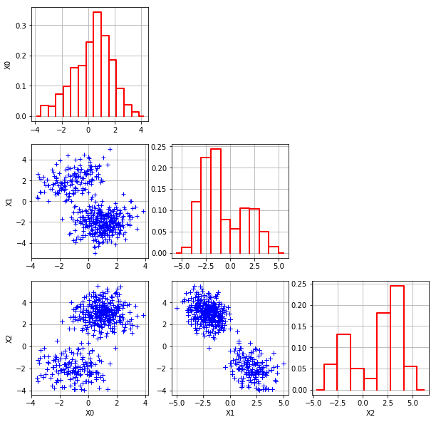

|CI|_ |Python|_ |License|_

.. |CI| image:: https://circleci.com/gh/tupui/othdrplot.svg?style=svg
.. _CI: https://circleci.com/gh/tupui/othdrplot

.. |Python| image:: https://img.shields.io/badge/python-2.7,_3.7-blue.svg
.. _Python: https://python.org

.. |License| image:: https://img.shields.io/badge/license-LGPL-blue.svg
.. _License: https://opensource.org/licenses/LGPL

otHDRPlot
=========

What is it?
-----------

This project implements the Functional highest density region boxplot technique [Hyndman2009]_.
It is based on `OpenTURNS <http://www.openturns.org>`_.

When you have functional data (i.e. a curve), you will want to answer
some questions such as:

* What is the median curve?
* Can I draw a confidence interval?
* Or, is there any outliers?

This module allows you to do exactly this: 

.. code-block:: python

    hdr = ProcessHighDensityRegionAlgorithm(processSample)
    hdr.setOutlierAlpha(0.8)
    hdr.run()
    hdr.drawOutlierTrajectories()

The output is the following figure: 

.. image::  doc/images/npfda-elnino-OutlierTrajectoryPlot.png

With a multivariate sample, the 
MatrixPlot allows to plot the 
scatter plot matrix, with the density on the diagonal.

.. code-block:: python

	mp = MatrixPlot(sample)
	_ = mp.draw()

The output is the following figure: 

In the situation where a multivariate sample is given, the 
HighDensityRegionAlgorithm allows to plot the 
regions where the density is associated with a 
given fraction of the population.

.. code-block:: python

    # Estimate the distribution
    myks = ot.KernelSmoothing()
    distribution = myks.build(sample)
    # Create the HDR algorithm
    mydp = HighDensityRegionAlgorithm(sample, distribution)
    mydp.run()
    _ = mydp.drawContour(drawData=False, drawOutliers=True)

The output is the following figure: 

.. image::  doc/images/gauss-mixture-OutlierPlot.png

How to install?
---------------

Requirements
............

The dependencies are: 

- Python >= 2.7 or >= 3.3
- `numpy <http://www.numpy.org>`_ >= 0.10
- `OpenTURNS <http://www.openturns.org>`_ >= 1.12
- `matplotlib <https://matplotlib.org>`_ >= 1.5.3

Installation
............

Using the latest python version is prefered! Then to install::

    git clone git@github.com:mbaudin47/othdrplot.git
    cd othdrplot
    python setup.py install

References
----------

.. [Hyndman2009] Rob J Hyndman and Han Lin Shang. Rainbow plots , bagplots and boxplots for functional data. Journal of Computational and Graphical Statistics, 19:29-45, 2009

Algorithms
----------

Three classes are provided:

- `MatrixPlot` : For a multivariate sample, a matrix of scatter plots with the density on the diagonal.
- `HighDensityRegionAlgorithm` : An algorithm to draw the density of a multivariate sample. 
- `ProcessHighDensityRegionAlgorithm` : An algorithm to compute and draw the density of a multivariate process sample. 

The `HighDensityRegionAlgorithm` class
......................................

This is an algorithm to draw the density of a multivariate sample.

- Compute the minimum levelset associated with the sample.
- Plots the required minimum level sets and the outliers. 
- Compute and draw the inliers and the outliers, based on the `MatrixPlot`.
- The main ingredient is distribution of the sample, which is required. 

The basic method to estimate this distribution is kernel smoothing, 
but any other method can be used, such as a gaussian mixture for example. 

The `ProcessHighDensityRegionAlgorithm` class
.............................................

This is an algorithm to draw the density of a process sample. 

- Plots the trajectories in the physical space.
- Plots the projection of the trajectories in the reduced space, based on the `HighDensityRegionAlgorithm`. 
- The main ingredients are the dimension reduction method and the method to estimate the density in the reduced space. 

In the current implementation, the dimension reduction must be provided 
and based on the KarhunenLoeve decomposition (which can be computed 
from the SVD or other methods as well). 
The method to estimate the density in the reduced space is necessarily the 
kernel smoothing in the current implementation. 

