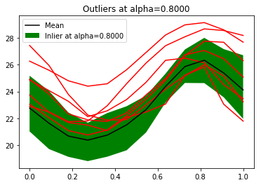

|CI|_ |Python|_ |License|_

.. |CI| image:: https://circleci.com/gh/tupui/othdrplot.svg?style=svg
.. _CI: https://circleci.com/gh/tupui/othdrplot

.. |Python| image:: https://img.shields.io/badge/python-2.7,_3.7-blue.svg
.. _Python: https://python.org

.. |License| image:: https://img.shields.io/badge/license-LGPL-blue.svg
.. _License: https://opensource.org/licenses/LGPL

otHDRPlot
=========

What is it?
-----------

This project implements the Functional highest density region boxplot technique [Hyndman2009]_.
It is based on `OpenTURNS <http://www.openturns.org>`_.

When you have functional data, which is to say: a curve, you will want to answer
some questions such as:

* What is the median curve?
* Can I draw a confidence interval?
* Or, is there any outliers?

This module allows you to do exactly this: 

.. code-block:: python

    hdr = ProcessHighDensityRegionAlgorithm(sample)
    hdr.setOutlierAlpha(0.8)
    hdr.run()
    hdr.plotOutlierTrajectories()

The output is the following figure: 

In the situation where a multivariate sample is given, the 
HighDensityRegionAlgorithm allows to plot the 
regions where the density is associated with a 
given fraction of the population.

.. code-block:: python

    sample = ot.Sample.ImportFromCSVFile('gauss-mixture.csv')
    # Estimate the distribution
    myks = ot.KernelSmoothing()
    sampleDistribution = myks.build(sample)
    # Create the HDR algorithm
    mydp = HighDensityRegionAlgorithm(sample, sampleDistribution)
    mydp.run()
    # Draw contour
    plotData = False
    mydp.plotContour(plotData)
    plt.show()

The output is the following figure: 

.. image::  doc/images/gauss-mixture-OutlierPlot.png

Requirements
------------

The dependencies are: 

- Python >= 2.7 or >= 3.3
- `numpy <http://www.numpy.org>`_ >= 0.10
- `OpenTURNS <http://www.openturns.org>`_ >= 1.12
- `matplotlib <https://matplotlib.org>`_ >= 1.5.3

References
----------

.. [Hyndman2009] Rob J Hyndman and Han Lin Shang. Rainb ow plots , bagplots and b oxplots for functional data. Journal of Computational and Graphical Statistics, 19:29-45, 2009

Algorithms
##########

There are two classes:

- HighDensityRegionAlgorithm : Un algorithme pour calculer la densité d'un échantillon de points multidimensionnel
- ProcessHighDensityRegionAlgorithm : Un algorithme pour calculer la densité d'un échantillon de trajectoires 

The HighDensityRegionAlgorithm class
####################################

Algorithme pour calculer la densité d'un échantillon de points multidimensionnel

- Calcul du min. levelset
- Graphique des levelset à 50% et 95%, outliers 
- Calcul des points inliers et outliers
- Ingrédient : Une méthode pour estimer la densité d'un échantillon de points : kernel smoothing, mélange de gaussienne (otmixmod) 

The ProcessHighDensityRegionAlgorithm class
###########################################

Algorithme pour calculer la densité d'un échantillon de trajectoires

- Graphique des trajectoires dans la bande à 50% et 95%, outliers
- Ingrédients : Une méthode de réduction de dimension : ACP

Roadmap
#######

TODO-List  général
******************

- Créer une classe pour l’ACP. Draft de Géraud. Sortir l’ACP de la classe Process pour pouvoir remplacer par KL

TODO-List  HighDensityRegionAlgorithm 
*************************************

- pouvoir créer le graphique avec une dimension supérieure à 2 : utiliser un Pairs avec des lignes de contours (actuellement : uniquement dimension 2)
- Pouvoir spécifier la méthode d’estimation de densité que l’on souhaite (actuellement : uniquement KernelSmoothing)
- créer un exemple pour utiliser un mélange de gaussiennes
- print the part of explained variance in the title

TODO-List  ProcessHighDensityRegionAlgorithm 
********************************************

- print the highest density trajectory instead of the mean ; this is the trajectory with the highest density. 
This is because the date-by-date mean is not actually a 
trajectory. 

- pouvoir avoir un nombre de composantes principales supérieur à 2 (actuellement : uniquement dimension 2)
- pouvoir choisir une autre méthode de réduction de dimension, comme par exemple avec la réduction de dimension par Karhunen-Loève (actuellement : uniquement par ACP)
- méthode de Pamphile
