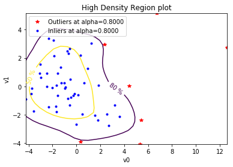

========================
Documentation of the API
========================

This is the user manual for the Python bindings to the othdrplot library.

How does it work?
-----------------

The dataset output is considered as a matrix where each line corresponds to a
sample. This matrix is decomposed by Proper Orthogonal Decomposition (POD).
The modes are ordered by decreasing importance in terms of contribution to the
variance and only a finite number of modes are kept. In this reduced space,
the functional dataset of large dimensions is conveniently represented by a
limited number of scalars mapped onto most significant directions that maximizes
the variance of the response variable. Within this reduced space, the
classification of different patterns or the computation of metrics is eased.
Hence, within this reduced space, the median sample corresponds to
the HDR location. The distance to this point is computed in the modal space;
the further a point is from the HDR, the less probable is the sample. The term
*median*, which is used in the literature, is restrictive if there are multiple
clusters of point in the reduced space.

A multivariate Kernel Density Estimation (KDE) technique is used to estimate
the PDF $\hat{f}(\mathbf{x_r})$ of this multivariate space. From this KDE, the
HDR reads

.. math:: R_\alpha = {x_r: \hat{f}(\mathbf{x_r}) \geq f_{\alpha}},

with :math:`f_{\alpha}` such that :math:`\int_{R_\alpha} \hat{f}(\mathbf{x_r}) d x_r = 1 - \alpha`.
With this definition, the HDR corresponds to the region of highest PDF with a
cumulative probability of :math:`1-\alpha`. By construction a HDR develops
around the maximum PDF :math:`\max \{\hat{f}(\mathbf{x_r})\}` which identifies
the most probable mode. Transposed using the inverse transform from the reduced
space to the original space, this most probable mode corresponds to the
"central curve"---also referred to as the median curve. 

Except if the response variable of the system of interest is chaotic under the
perturbation of its input parameters, the POD is expected to drastically reduce
the dimensionality of the problem. Furthermore, as the system's response
variable is also expected to oscillate around some modes, the points in the
reduced space are likely to be relatively clustered around the modes. This
mitigates the difficulty of the density estimation procedure.

.. image::  images/npfda-elnino-scatter.png

This figure illustrates the El Niño dataset in the reduced space when only two
modes are retained ensuring that at least 80% of the response variable variance
is conserved. This visualization exhibit a cluster of points. It indicate that
a lot of curve lead to common components. Following a KDE is computed.

Each realization can be characterized with respect to the HDR metric.
In the modal space, each dot represents a realization within the dataset and
the contouring represents the 50% and 80% quantiles.

In the response variable physical space, the outliers are *red curves*,
the *thick black curve* is the median and the *green areas* represent 50% and
80% quantiles envelopes. It should be noted that additional realizations with
chosen characteristics on the outputs could be drawn by sampling the input for
specific HDR criteria.

.. image::  images/npfda-elnino-OutlierTrajectoryPlot.png

.. currentmodule:: othdrplot

otHDRPlot
=========

.. autosummary::
    :toctree: _generated/
    :template: class.rst_t
    :nosignatures:

    HighDensityRegionAlgorithm
    ProcessHighDensityRegionAlgorithm
